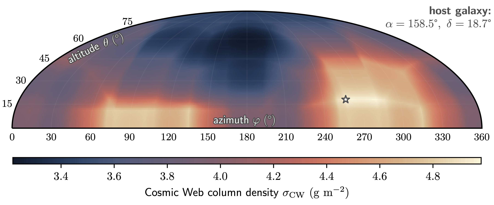

# Black hole jets
This is a Python package that enables measurements of black hole jet orientations from radio astronomical images, and cosmic web filament orientations from 3D large-scale structure maps. It also enables analyses of the relationship between these orientations. Finally, the package produces publication-ready plots.

# Installation
```bash
# Option 1: Clone over HTTPS (no SSH keys needed; recommended).
git clone https://github.com/Marshlandss/jets.git
# Option 2: Clone over SSH (SSH keys needed).
git clone git@github.com:Marshlandss/jets.git
```
```bash
cd jets

# Option 1: Install dependencies with conda (recommended).
conda env create -f environment.yaml
conda activate jets
# Option 2: Install dependencies with pip.
python -m pip install -e .
```
The package is now installed in editable mode: a `git pull` updates your installation immediately.
(Re-run `python -m pip install -e .` if dependencies change.)

# Configuration
Before running any code, set two environment variables:
- `JETS_DIR_LOAD`: the directory containing the input catalogue, BORG SDSS cubes, and a subdirectory `fits/` with the radio cutouts;
- `JETS_DIR_SAVE`: the directory to which output (tables and plots) is written; the code creates any subdirectories it needs.

Choose either of these options:

```bash
# Option 1 (all OSs): Store the variables in your conda environment.
conda activate jets
conda env config vars set JETS_DIR_LOAD="/path/to/load" JETS_DIR_SAVE="/path/to/save"
conda deactivate
conda activate jets            # Re-activate so that the variables take effect.
conda env config vars list     # Check.

# Option 2 (macOS and Linux): Store the variables in your shell profile.
# For instance, to edit ~/.zshrc on macOS, type 'open -e ~/.zshrc'.
# The changes take effect in new terminal windows.
export JETS_DIR_LOAD="/path/to/load"
export JETS_DIR_SAVE="/path/to/save"
```
Surround paths that contain spaces with quotes: e.g. `"G:/My Drive/..."`.
If you run code from an IDE, check that its run configuration sees these variables.

# Usage
Run `python scripts/get_jet_orientations.py` to obtain radio–optical images with jet–filament overlays:
<div align="center">
  
</div>

Run `python scripts/plot_column_densities_hemisphere.py` to visualise the galactocentric cosmic web column density as a function of line segment orientation:
<div align="center">
  
</div>